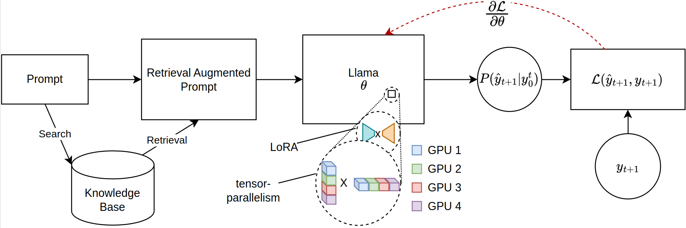

# JORA


The scaling of Large Language Models (LLMs) for retrieval-based tasks, particularly in Retrieval Augmented Generation (RAG), faces significant memory constraints, especially when fine-tuning extensive prompt sequences. Current open-source libraries support full-model inference and fine-tuning across multiple GPUs but fall short of accommodating the efficient parameter distribution required for retrieved context. Addressing this gap, we introduce a novel framework for PEFT-compatible fine-tuning of Llama-2 models, leveraging distributed training. Our framework uniquely utilizes JAX's just-in-time (JIT) compilation and tensor-sharding for efficient resource management, thereby enabling accelerated fine-tuning with reduced memory requirements. This advancement significantly improves the scalability and feasibility of fine-tuning LLMs for complex RAG applications, even on systems with limited GPU resources. Our experiments show more than 12x improvement in runtime compared to Hugging Face/DeepSpeed implementation with four GPUs while consuming less than half the VRAM per GPU. Our library will be open-sourced in due course.

---

## Installation
To install the package, run the following command in the root directory of the repository:

```bash
git clone https://github.com/aniquetahir/JORA.git
cd JORA
export PYTHONPATH=$(pwd)
```

## Usage
The library can be used through python, or alternatively, a gui is provided.

### Using as a library
The Parallama class can be used to define the configuration. Sensible parameters are set as defaults.
```python
class ParallamaConfig(NamedTuple):
    JAX_PARAMS_PATH: str
    LLAMA2_META_PATH: str # e.g. '/tmp/llama2-13B'
    MODEL_SIZE: str # '7B', '13B', '70B'
    NUM_GPUS: int = None
    LORA_R: int = 16
    LORA_ALPHA: int = 16
    LORA_DROPOUT: float = 0.05
    LR: float = 0.0001
    BATCH_SIZE: int = 1
    N_ACCUMULATION_STEPS: int = 8
    MAX_SEQ_LEN = 2000
    N_EPOCHS: int = 7
    SEED: int = 420
```

#### Example Usage
```python
from jora import train_lora, ParallamaConfig, generate_alpaca_dataset

config = ParallamaConfig(MODEL_SIZE=model_size, JAX_PARAMS_PATH=jax_path,
                         LLAMA2_META_PATH=hf_path)
dataset = generate_alpaca_dataset(dataset_path, 'train', config)
train_lora(config, dataset, checkpoint_path)
```

The `generate_alpaca_dataset` function is used to generate the dataset from an Alpaca format json file. This helps with 
instruct format training since the dataset processing, tokenization, and batching is handled by the library. Alternatively,
torch `Dataset` and `DataLoader` can be used for custom datasets.

### Using trained model with huggingface compatible libraries
HuggingFace has a vast ecosystem. Since our library uses jax for training, the resulting model is incompatible. To solve this 
issue, we provide a submodule for converting a jax trained model back to the huggingface format.
```
SYNOPSIS
    python -m jora.hf HUGGINGFACE_PATH JAX_PATH SAVE_PATH

DESCRIPTION
    This function takes a huggingface llama model and replaces the q_proj and v_proj weights with the lora merged weights

POSITIONAL ARGUMENTS
    HUGGINGFACE_PATH
        Type: str
        path to the huggingface llama model
    JAX_PATH
        Type: str
        path to the lora merged params
    SAVE_PATH
        Type: str
        path to save the updated huggingface llama model

NOTES
    You can also use flags syntax for POSITIONAL ARGUMENTS
```

### Using the GUI
The GUI can be used to train a model. The GUI is started by running the following command:
```bash
python -m jora.gui
```

## Evaluation
|                                                                                                   | GPUs           | 1                                                   | 2                                                      | 4                                                                |
|---------------------------------------------------------------------------------------------------|----------------|-----------------------------------------------------|--------------------------------------------------------|------------------------------------------------------------------|
| **Hugging Face PEFT w/ Microsoft DeepSpeed ZeRO-3**                                               | **Mem (MB)**   | **20645.2 (39.81)**                                 | 23056 / 23024 (14.63 / 29.29)                          | 23978 / 23921 / 23463 / 23397 (47.87 / 50.39 / 31.96 / 17.46)    |
|                                                                                                   | **Performance (secs)** | 4.56 (0.04)                                         | 2.81 (0.02)                                             | 5.45 (0.09)                                                      |
| **JORA (Ours)**                                                                                   | **Mem (MB)**   | 23102 (0.00)                                        | **16068 / 16008 (0.00 / 0.00)**                        | **11460 / 11448 / 11448 / 11400 (0.0 / 0.00 / 0.00 / 0.00)**     |
|                                                                                                   | **Performance (secs)** | **0.19 (0.00)**                                     | **0.79 (0.00)**                                         | **0.44 (0.00)**                                                  |


## Contributing
There are several places where contributions would be appreciated. 
- Need to test `setup.py`/`requirements.txt` for easy installation.
- Docker container (nvidia-docker)
- JAX MPI for multi-node setups. Currently works with single-node multi-gpu setup.

## Acknowledgements
Jax Llama-2 model implementation by [ayaka14732](https://github.com/ayaka14732/llama-2-jax)
